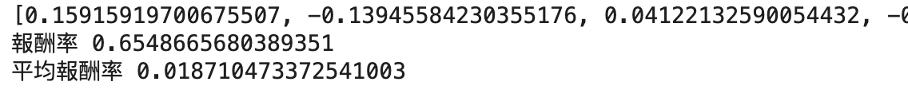

# TW_stock_analysis

## 專案簡介
TW_stock_analysis 是一個用於分析台灣股票市場的專案。目標是訓練機器學習模型（RandomForest 和 XGBoost），根據自定義的標準對股票進行評分（1 至 5 分），並篩選出評分為 5 的股票進行回測，以評估策略的效果。

##  資料來源
本專案使用 [yfinance](https://github.com/ranaroussi/yfinance) 套件下載台灣上市股票資料。

##  模型選擇
- **RandomForest**
  
- **XGBoost**

### 執行模型訓練與回測
1. 資料處理：
   執行 `股票資料處理.ipynb`，將股票資料整理並生成特徵。
2. 模型訓練：
   執行 `模型.ipynb`，訓練模型並保存為 `.pkl` 檔案。
3. 回測分析：
   執行 `回測.ipynb`，對評分為 5 的股票進行回測並計算報酬率。
###  輸出範例

